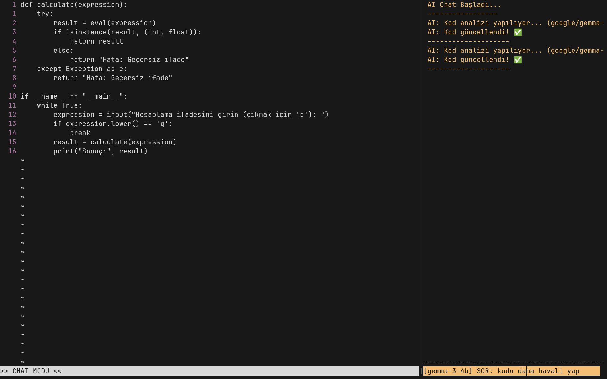

# Queyntisen



Python ile yazılmış, Büyük Dil Modelleri (LLM) ile doğal entegrasyona sahip, Vim'den esinlenmiş yeni nesil bir terminal editörü.

Düzenleme modeli Vim'in modal yapısına (Normal, Ekleme, Görsel modlar) dayanır; ancak bu iş akışını, doğrudan editörün içine gömülü bir yapay zeka asistanı ile genişletir. Bu sayede terminal arayüzünden çıkmadan bağlam farkındalıklı kod üretimi, yeniden düzenleme (refactoring) ve hata düzeltme işlemleri yapılabilir.

Queyntisen, Yerel LLM'ler (LM Studio/Ollama aracılığıyla) veya OpenAI API ile çalışmak üzere tasarlanmıştır.

# Özellikler

- **Modal Düzenleme:** Gezinme ve düzenleme için Vim uyumlu tuş atamaları (`hjkl`, `dd`, `yy`, `:`, `/`).
- **Doğal AI Entegrasyonu:** Kod bağlamını koruyarak LLM'ler ile iletişim kurmak için bölünmüş panel arayüzü (`Ctrl+w`).
- **Bloklamayan Arayüz:** Ağır AI işlemleri arka plan iş parçacıklarında (threading) çalışır, editör tepki vermeye devam eder.
- **Akıllı Bağlam:** Bağlam farkındalıklı cevaplar için mevcut dosya içeriğini modele otomatik olarak besler.
- **Otomatik Uygulama:** AI tarafından üretilen kod değişikliklerini doğrudan dosyaya uygulama yeteneği.

# Kurulum

## Otomatik Kurulum (Linux/macOS)

Ortamı hazırlamak ve `queyntisen` komutunu sisteme eklemek için:

```bash
git clone [https://github.com/KULLANICI_ADIN/Queyntisen.git](https://github.com/KULLANICI_ADIN/Queyntisen.git)
cd Queyntisen
chmod +x install.sh
./install.sh
```
## Manuel Kurulum

Queyntisen, Python 3.8+ ve openai kütüphanesini gerektirir.

```python git clone [https://github.com/KULLANICI_ADIN/Queyntisen.git](https://github.com/KULLANICI_ADIN/Queyntisen.git)
cd Queyntisen
pip install -r requirements.txt
python editor.py
```
# Yapılandırma

Yapay zeka ayarları editor.py dosyasının en üstündeki değişkenlerden yapılır:

## Yerel LLM'ler İçin (Varsayılan)

```python 
API_KEY = "lm-studio"
BASE_URL = "http://localhost:1234/v1"
```
## OpenAI API İçin

```python
API_KEY = os.getenv("OPENAI_API_KEY")
BASE_URL = "[https://api.openai.com/v1](https://api.openai.com/v1)"
```
# Lisans

Bu proje GNU General Public License v3.0 altında lisanslanmıştır. Detaylar için LICENSE dosyasına bakınız.


