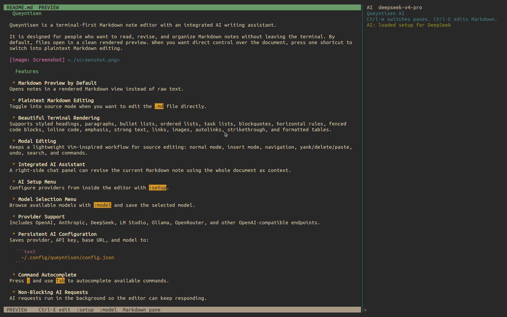

# Queyntisen

Queyntisen is a terminal-first Markdown note editor with an integrated AI writing assistant.

It is designed for people who want to read, revise, and organize Markdown notes without leaving the terminal. By default, files open in a clean rendered preview. When you want direct control over the document, press one shortcut to switch into plaintext Markdown editing.



## Features

- **Markdown Preview by Default**  
  Opens notes in a rendered Markdown view instead of raw text.

- **Plaintext Markdown Editing**  
  Toggle into source mode when you want to edit the `.md` file directly.

- **Beautiful Terminal Rendering**  
  Supports styled headings, paragraphs, bullet lists, ordered lists, task lists, blockquotes, horizontal rules, fenced code blocks, inline code, emphasis, strong text, links, images, autolinks, strikethrough, and formatted tables.

- **Modal Editing**  
  Keeps a lightweight Vim-inspired workflow for source editing: normal mode, insert mode, navigation, yank/delete/paste, undo, search, and commands.

- **Integrated AI Assistant**  
  A right-side chat panel can revise the current Markdown note using the whole document as context.

- **AI Setup Menu**  
  Configure providers from inside the editor with `:setup`.

- **Model Selection Menu**  
  Browse available models with `:model` and save the selected model.

- **Provider Support**  
  Includes OpenAI, Anthropic, DeepSeek, LM Studio, Ollama, OpenRouter, and other OpenAI-compatible endpoints.

- **Persistent AI Configuration**  
  Saves provider, API key, base URL, and model to:

  ```text
  ~/.config/queyntisen/config.json
  ```

- **Command Autocomplete**  
  Press `:` and use `Tab` to autocomplete available commands.

- **Non-Blocking AI Requests**  
  AI requests run in the background so the editor can keep responding.

## Installation

### Automatic Install

```bash
git clone https://github.com/fMert/Queyntisen.git
cd Queyntisen
chmod +x install.sh
./install.sh
```

After installation, restart your terminal and run:

```bash
queyntisen notes.md
```

The installer is designed for Linux and macOS. It installs into your home directory, creates an isolated Python virtual environment, installs a `queyntisen` launcher, checks Python support, and prints each step as it runs.

Useful installer options:

```bash
./install.sh --help
./install.sh --no-path-edit
./install.sh --install-dir ~/.queyntisen --bin-dir ~/.local/bin
./install.sh --uninstall
./install.sh --uninstall --purge-config
```

By default, uninstall keeps your saved AI setup in `~/.config/queyntisen`.

### Manual Install

Queyntisen requires Python 3.8+.

```bash
git clone https://github.com/fMert/Queyntisen.git
cd Queyntisen
pip install -r requirements.txt
python3 editor.py notes.md
```

## Basic Usage

Open an existing Markdown file:

```bash
python3 editor.py notes.md
```

Create a new Markdown file:

```bash
python3 editor.py new-note.md
```

If no file is provided, Queyntisen opens an untitled note. Save it with `:w filename.md`.

## Views

Queyntisen has two Markdown views.

| View | Purpose |
| --- | --- |
| Preview | Read the note as rendered Markdown |
| Source | Edit the raw Markdown text |

Shortcut:

| Key | Action |
| --- | --- |
| `Ctrl-E` | Toggle between Preview and Source |

Preview is the default view.

## Panes

Queyntisen has two panes:

| Pane | Purpose |
| --- | --- |
| Note | Markdown preview/source editor |
| AI | Chat with the writing assistant |

Shortcut:

| Key | Action |
| --- | --- |
| `Ctrl-W` | Switch between Note and AI panes |

## Preview Mode

Preview mode is for reading and reviewing the rendered note.

| Key | Action |
| --- | --- |
| `j` / `Down` | Scroll down |
| `k` / `Up` | Scroll up |
| `Space` / `PageDown` | Page down |
| `PageUp` | Page up |
| `i` | Switch to Source view and enter Insert mode |
| `/` | Search |
| `:` | Open command prompt |
| `q` | Show quit hint |

## Source Mode

Source mode is for direct Markdown editing.

### Normal Mode

| Key | Action |
| --- | --- |
| `i` | Enter Insert mode |
| `h` / `Left` | Move left |
| `j` / `Down` | Move down |
| `k` / `Up` | Move up |
| `l` / `Right` | Move right |
| `0` | Move to start of line |
| `$` | Move to end of line |
| `yy` | Copy current line |
| `dd` | Delete current line |
| `p` | Paste copied/deleted line below |
| `u` | Undo |
| `/` | Search |
| `n` | Next search result |
| `N` / `b` | Previous search result |
| `:` | Open command prompt |

### Insert Mode

| Key | Action |
| --- | --- |
| `Esc` | Return to Normal mode |
| `Enter` | New line |
| `Tab` | Insert four spaces |
| `Backspace` | Delete character or join with previous line |
| Arrow keys | Move cursor |

## Commands

Open the command prompt with `:`.

| Command | Action |
| --- | --- |
| `:w` | Save current file |
| `:w filename.md` | Save as a specific file |
| `:q` | Quit |
| `:wq` | Save and quit |
| `:x` | Save and quit |
| `:setup` | Open AI provider setup |
| `:model` | Open model selection |

Command autocomplete:

| Key | Action |
| --- | --- |
| `Tab` | Autocomplete the command prefix |
| `Esc` | Close the command prompt |

## AI Assistant

The AI assistant works from the right-side pane.

1. Press `Ctrl-W` to move to the AI pane.
2. Type a request.
3. Press `Enter`.
4. Queyntisen sends the full Markdown note plus your request to the selected model.
5. The model returns a complete revised Markdown document.
6. Queyntisen applies the result to the current buffer.

The AI prompt is tuned for Markdown note writing. It asks the model to improve clarity, structure, organization, and usefulness while preserving the user's intent.

Examples:

```text
Turn this into meeting notes with action items.
```

```text
Rewrite this as a cleaner project plan.
```

```text
Organize this note with headings and task lists.
```

```text
Make this more concise but keep all important details.
```

## AI Setup

Run:

```text
:setup
```

The setup menu lets you configure:

- Provider
- API key
- Base URL
- Model

Supported providers:

| Provider | Notes |
| --- | --- |
| OpenAI | Uses the OpenAI API |
| Anthropic | Uses the Anthropic Messages API |
| DeepSeek | Uses an OpenAI-compatible endpoint |
| LM Studio | Local OpenAI-compatible server |
| Ollama | Local Ollama server |
| OpenRouter | OpenAI-compatible routing provider |
| Other | Any OpenAI-compatible endpoint |

Setup menu keys:

| Key | Action |
| --- | --- |
| Arrow keys / `Tab` | Move through fields |
| `Enter` | Edit selected field |
| `T` | Test connection |
| `S` | Save setup after validation |
| `Esc` | Cancel setup |

Saved AI configuration is stored at:

```text
~/.config/queyntisen/config.json
```

The file is written with user-only permissions.

## Model Selection

Run:

```text
:model
```

The model menu shows providers on the left and available models on the right.

Model menu keys:

| Key | Action |
| --- | --- |
| `Left` / `Right` | Switch provider |
| `Up` / `Down` | Select model |
| `Enter` | Save selected model |
| `R` | Reload models |
| `Esc` | Close menu |

If no models are available, Queyntisen will tell you to run `:setup`.

## Local Models

### LM Studio

Start an OpenAI-compatible local server in LM Studio, then use:

```text
:setup
```

Select:

```text
LM Studio (local)
```

Default base URL:

```text
http://localhost:1234/v1
```

### Ollama

Start Ollama and make sure at least one model is installed:

```bash
ollama pull llama3.1
```

Then run `:setup` and select:

```text
Ollama (local)
```

Default base URL:

```text
http://localhost:11434
```

## Environment Variables

You can still provide defaults through environment variables:

| Variable | Purpose |
| --- | --- |
| `QUEYNTISEN_API_KEY` | Default API key |
| `QUEYNTISEN_BASE_URL` | Default OpenAI-compatible base URL |
| `QUEYNTISEN_MODEL` | Default model |
| `OPENAI_API_KEY` | Fallback API key for OpenAI-compatible providers |

The in-editor `:setup` menu is the recommended configuration method.

## Philosophy

Queyntisen is not trying to be a full IDE. It is a focused Markdown workspace:

- read notes beautifully,
- edit Markdown directly when needed,
- use AI to reorganize and improve writing,
- stay inside the terminal.

## License

Queyntisen is licensed under the GNU General Public License v3.0. See [LICENSE](./LICENSE) for details.
